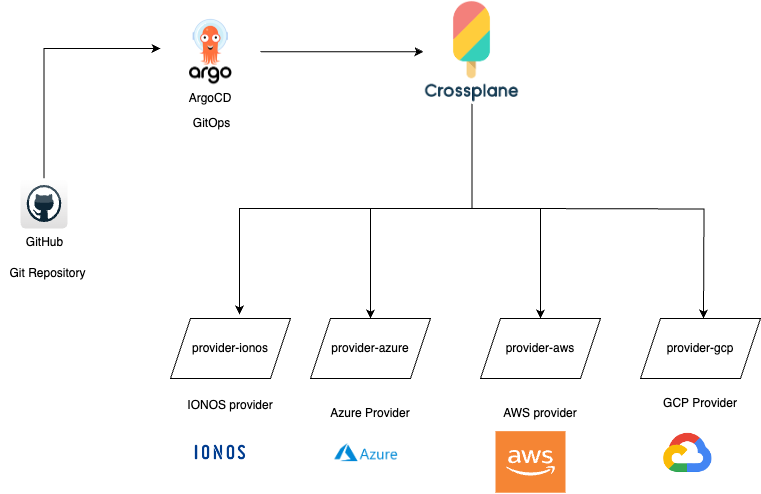

# Platform Infrastructure for AWS (PoC)
PoC for creating an IDP (Internal Developer Platform) platform with ArgoCD and Crossplane in a multi-cloud environment

## Architecture (for Multi-cloud)

The architecture for the Platform can be found below:



## Tools used/Required
 
* `kubectl` CLI installed (can be found [here]())
* ``

Create a kind cluster using the following command:

```shell
kind create cluster --config ./cluster/kind-cluster.yaml
```

This will create a self-hosted cluster in your local machine where the IDP would be created with ArgoCD and Crossplane.


## AWS Specific

### Crossplane

Please refer to [this link](crossplane/README_aws.md) for instructions on setting up Crossplane in AWS environment.

## Install Kustomize

Kustomize helps in customizing the installation steps in order

Installation ways:

1. [From source code](https://kubectl.docs.kubernetes.io/installation/kustomize/source/)

2. [Binaries](https://kubectl.docs.kubernetes.io/installation/kustomize/binaries/)

3. [Mac (Homebrew)](https://kubectl.docs.kubernetes.io/installation/kustomize/homebrew/)

4. [Windows (using Chocolatey)](https://kubectl.docs.kubernetes.io/installation/kustomize/chocolatey/)

## Install